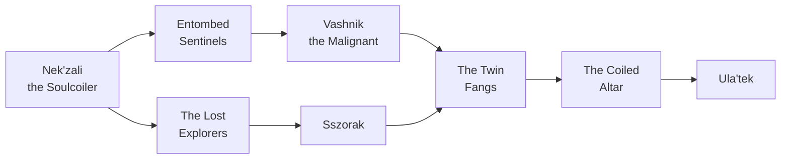

# The Venomous Abyss — 12.1 Midnight

Personal boss notes for the Midnight raid, *The Venomous Abyss*. One folder per encounter: a formatted `README.md` plus the raw `notes.txt`.

## Boss order

After Nek'zali the raid splits into two wings that can be cleared in either order, converging on The Twin Fangs.

| # | Wing | Boss | Notes |
|---|---|---|---|
| 1 | — | Nek'zali the Soulcoiler | [1.0 nekzali](1.0%20nekzali/README.md) |
| 2 | Left | Entombed Sentinels | [2.0 entombed sentinels](2.0%20entombed%20sentinels/README.md) |
| 2 | Right | The Lost Explorers | [2.1 lost explorers](2.1%20lost%20explorers/README.md) |
| 3 | Left | Vashnik the Malignant | [3.0 vashnik](3.0%20vashnik/README.md) |
| 3 | Right | Sszorak | [3.1 sszorak](3.1%20sszorak/README.md) |
| 4 | — | The Twin Fangs | [6.0 twin fangs](6.0%20twin%20fangs/README.md) |
| 5 | — | The Coiled Altar | [7.0 coiled altar](7.0%20coiled%20altar/README.md) |
| 6 | — | Ula'tek | [8.0 ulatek](8.0%20ulatek/notes.txt) — raw notes only |
